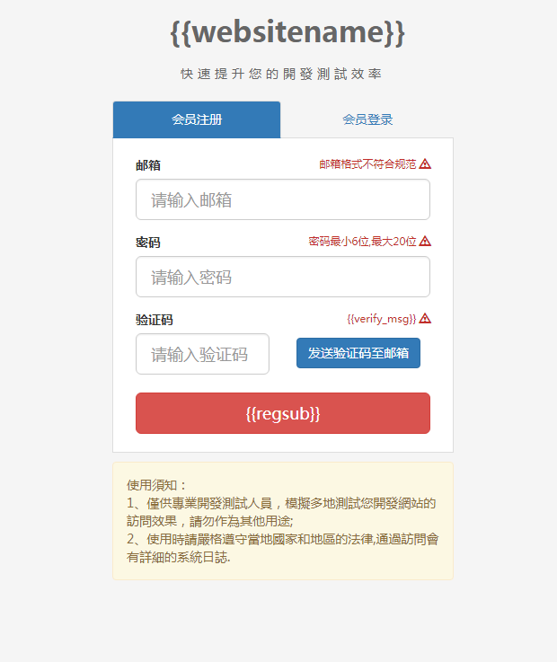

# DomeCroos Login Hacking

* [./code/0002_DomeCroos_Login.html](./code/0002_DomeCroos_Login.html)

## 参考文档

* [login.html](https://github.com/ZengjfOS/ChromeExtensions/blob/master/docs/code/0004_DomeCross/login.html)
* [log.css](https://github.com/ZengjfOS/ChromeExtensions/blob/master/docs/code/0004_DomeCross/css/log.css)



## Code Hacking

### Login.html

```HTML
<!DOCTYPE html>
<!-- 采用AngularJS库 -->
<html lang="zh-cn"ng-app="rocket">
<head>
    <meta charset="utf-8">
    <title>{{websitename}} {{banben}} - 註冊登錄</title>
    <!-- 采用Bootstrap -->
    <link href="lib/bootstrap/css/bootstrap.min.css" rel="stylesheet">   
    <!-- 引入自定义css样式 -->
    <link href="css/log.css" rel="stylesheet">
</head>

<!-- AngularJS控制器 -->
<body ng-controller="log">
<!-- 
    1. 如下div中均有container这个class，说明作为内容居中，这个还是比较好用的
    2. log.css:
        .margin_top_20{
            margin-top:20px;
        } 
-->
<div class="container text-center margin_top_20">
    <span class="title">{{websitename}}</span>
</div>
<!-- 
    1. log.css:
        .margin_top_15{
            margin-top:20px;
        } 
-->
<div class="container text-center margin_top_15">
    <span class="info">快速提升您的開發測試效率</span>
</div>

<div class="container margin_top_20">

    <!-- 
        1. log.css:
            .core{
                width: 380px;
                margin-left: auto;
                margin-right: auto;
            }
    -->
    <div class="core">
        <!-- Nav tabs -->
        <!-- 标签的标准写法, nav/nav-tabs的class和tablist的role -->
        <ul class="nav nav-tabs" role="tablist">
            <!-- 
                1. 每一个标签，指定tab的role和data-toggle；
                2. href指向div的id；
                3. 添加额外的aria-controls属性，容纳这个折叠块元素的id。现代的屏幕阅读器以及类似的辅助技术利用这个属性向用户提供额外的快捷方式，以径直导航到折叠块元素本身；
                4. class的active表示默认激活； 
            -->
            <li role="presentation" class="active tab_core_active tab_core text-center"><a href="#reg" id="register_tab"  aria-controls="reg" role="tab" data-toggle="tab">会员注册</a></li>
            <li role="presentation" class="tab_core text-center"><a href="#log" aria-controls="log" id="login_tab" role="tab" data-toggle="tab">会员登录</a></li>
        </ul>

        <!-- Tab panes -->
        <!-- 标签内容实体 -->
        <div class="tab-content">
            <!-- 
                1. class的active表示默认激活； 
                2. id是给前面的tablist的a标签的href引用的；
            -->
            <div role="tabpanel" class="tab-pane active " id="reg">
                <!--注册-->
                <!-
                    1. log.css:
                        .inside_form{
                            padding:20px 25px;
                        }-
                    2. novalidate 属性规定当提交表单时不对表单数据（输入）进行验证；
                -->
                <form name="regForm"  class="inside_form" novalidate>
                    <!-- 
                        1. VALIDATION STATES - Bootstrap includes validation styles for error, warning, and success messages. To use, add .has-warning, .has-error, or .has-success to the parent element
                    -->
                    <div class="form-group" ng-class="{'has-success' : !regForm.myEmail.$pristine && regForm.myEmail.$valid, 'has-error' : !regForm.myEmail.$pristine && regForm.myEmail.$invalid }">
                        <label for="exampleInputEmail1">邮箱</label>
                        <!-- 
                            1. pull-right，相当于将内容浮动往右靠；
                            2. log.css：
                                .tishi{
                                    font-size: 11px;
                                    color:#c12e2a;
                                }
                        -->
                        <span ng-show="regForm.myEmail.$dirty && regForm.myEmail.$invalid" class="pull-right tishi">
                            邮箱格式不符合规范
                            <span class="glyphicon glyphicon-warning-sign" aria-hidden="true"></span>
                        </span>
                        <input type="text" id="reg_email" name="myEmail" ng-model="myEmail" maxlength="35"  class="form-control input-lg" ng-pattern="/^([a-zA-Z0-9]+[_|\_|\.]?)*[a-zA-Z0-9\-]+@([a-zA-Z0-9\-]+[_|\_|\.]?)*[a-zA-Z0-9]+\.[a-zA-Z]{2,3}$/" placeholder="请输入邮箱" required>
                    </div>
                    <div class="form-group" ng-class="{'has-success' : !regForm.password.$pristine && regForm.password.$valid, 'has-error' : !regForm.password.$pristine && regForm.password.$invalid }">
                        <label for="exampleInputPass">密码</label>
                        <span ng-show="regForm.password.$dirty && regForm.password.$invalid" class="pull-right tishi">
                            密码最小6位,最大20位
                            <!-- Bootstrap 4: Dropped the Glyphicons icon font. -->
                            <span class="glyphicon glyphicon-warning-sign" aria-hidden="true"></span>
                        </span>
                        <input type="password" id="reg_password" minlength="6" maxlength="20" ng-model="password" name="password" class="form-control input-lg" placeholder="请输入密码" required>
                    </div>
                    <div class="form-group" ng-class="{'has-success' : !regForm.passwordagain.$pristine && regForm.passwordagain.$valid, 'has-error' : !regForm.passwordagain.$pristine && regForm.passwordagain.$invalid }">
                        <label for="exampleInputPassAgain">验证码</label>
                        <span ng-show="(regForm.passwordagain.$dirty && regForm.passwordagain.$invalid) || verify" class="pull-right tishi">
                            {{verify_msg}}
                            <span class="glyphicon glyphicon-warning-sign" aria-hidden="true"></span>
                        </span>
                        <div class="row">
                            <div class="col-md-6">
                                <input type="text" id="reg_verify"  minlength="4" maxlength="4" ng-pattern="/^[0-9a-zA-Z]*$/" ng-model="passwordagain" name="passwordagain" class="form-control input-lg" placeholder="请输入验证码"  veritycode required/>
                            </div>
                            <div  class="col-md-6">
                                <button type="button" class="btn btn-primary margin_top5" ng-disabled="verify_send" verify>发送验证码至邮箱</button>
                            </div>
                        </div>
                    </div>
                    <button type="submit" id="regsub" class="btn btn-danger btn-lg width_100 margin_top_10" ng-click="reg_sub();" ng-disabled="regForm.$invalid">{{regsub}}</button>
                </form>
            </div>
            <div role="tabpanel" class="tab-pane" id="log">
                <!--登录-->
                <form name="logForm"  class="inside_form" novalidate>
                    <div class="form-group" ng-class="{'has-success' : !logForm.myEmail.$pristine && logForm.myEmail.$valid, 'has-error' : !logForm.myEmail.$pristine && logForm.myEmail.$invalid }">
                        <label for="exampleInputEmail1">邮箱</label>
                        <span ng-show="logForm.myEmail.$dirty && logForm.myEmail.$invalid" class="pull-right tishi">
                            邮箱格式不符合规范
                            <span class="glyphicon glyphicon-warning-sign" aria-hidden="true"></span>
                        </span>
                        <input type="text" id="log_email" name="myEmail" ng-model="myEmail" maxlength="35"  class="form-control input-lg" ng-pattern="/^([a-zA-Z0-9]+[_|\_|\.]?)*[a-zA-Z0-9\-]+@([a-zA-Z0-9]+[_|\_|\.]?)*[a-zA-Z0-9]+\.[a-zA-Z]{2,3}$/" placeholder="请输入邮箱" required>
                    </div>
                    <div class="form-group" ng-class="{'has-success' : !logForm.password.$pristine && logForm.password.$valid, 'has-error' : !logForm.password.$pristine && logForm.password.$invalid }">
                        <label for="exampleInputPass">密码</label>
                        <span ng-show="logForm.password.$dirty && logForm.password.$invalid" class="pull-right tishi">
                            密码最小6位,最大20位
                            <span class="glyphicon glyphicon-warning-sign" aria-hidden="true"></span>
                        </span>
                        <input type="password" id="log_password" minlength="6" maxlength="20" ng-model="password" name="password"  class="form-control input-lg" placeholder="请输入密码" required>
                    </div>
                    <button type="submit" id="logsub" class="btn btn-danger btn-lg width_100 margin_top_10" ng-click="log_sub();" ng-disabled="logForm.$invalid">{{logsub}}</button>
                    <div class="wjmm"><a href="forget.html" target="_blank">忘记密码</a></div>
                </form>
            </div>
        </div>
        <div class="alert alert-success"  id="ts_success" role="alert" style="margin-top: 10px; display:none;"></div>
        <div class="alert alert-danger"  id="ts_error" role="alert" style="margin-top: 10px; display:none;"></div>

        <div class="alert alert-warning" role="alert" style="margin-top: 10px;">
            使用須知：<br/>
            1、僅供專業開發測試人員，模擬多地測試您開發網站的訪問效果，請勿作為其他用途;<br/>
            2、使用時請嚴格遵守當地國家和地區的法律,通過訪問會有詳細的系統日誌.<br/>
        </div>

    </div>
</div>

<script src="lib/jquery/jquery-1.12.2.min.js"></script>
<script src="lib/bootstrap/js/bootstrap.min.js"></script>
<script src="lib/tldjs.js"></script>
<script src="lib/md5.js"></script>
<script src="js/main.js"></script>

</body>
</html>
```

### log.css

```CSS
body{
    background-color: #F5F5F5;
    font-family: "Hiragino Sans GB", "Microsoft YaHei", "WenQuanYi Micro Hei", sans-serif;
}

.margin_top_20{
    margin-top:20px;
}


.margin_top_15{
    margin-top:15px;
}

.title{
    font-size: 32px;
    font-weight: bold;
    color:#666666;
    margin-left: 10px;
}

.info{
    color:#666666;
    letter-spacing:5px;
}

.info b{
    color:#000;
}
.core{
    width: 380px;
    margin-left: auto;
    margin-right: auto;
}

.tab_core{
    width: 190px;
}
.tab-content{
    background: #fff;
    border: 1px solid #ddd;
    border-top: none;
}
.nav-tabs>li.active>a, .nav-tabs>li.active>a:focus, .nav-tabs>li.active>a:hover{
    background-color:#337ab7;
    color:#FFF;
}

.width_100{
    width: 100%;
}
.margin_top_10{
    margin-top: 5px;
}
.inside_form{
    padding:20px 25px;
}

.btn-danger.disabled, .btn-danger.disabled.active, .btn-danger.disabled.focus, .btn-danger.disabled:active, .btn-danger.disabled:focus, .btn-danger.disabled:hover, .btn-danger[disabled], .btn-danger[disabled].active, .btn-danger[disabled].focus, .btn-danger[disabled]:active, .btn-danger[disabled]:focus, .btn-danger[disabled]:hover, fieldset[disabled] .btn-danger, fieldset[disabled] .btn-danger.active, fieldset[disabled] .btn-danger.focus, fieldset[disabled] .btn-danger:active, fieldset[disabled] .btn-danger:focus, fieldset[disabled] .btn-danger:hover{
    background-color: #d40001;
}

.tishi{
    font-size: 11px;
    color:#c12e2a;
}
.margin_top5 {
    margin-top:5px;
}
.wjmm{
    margin-top: 20px;
    font-size: 11px;
}
```
