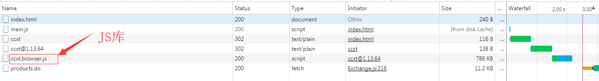
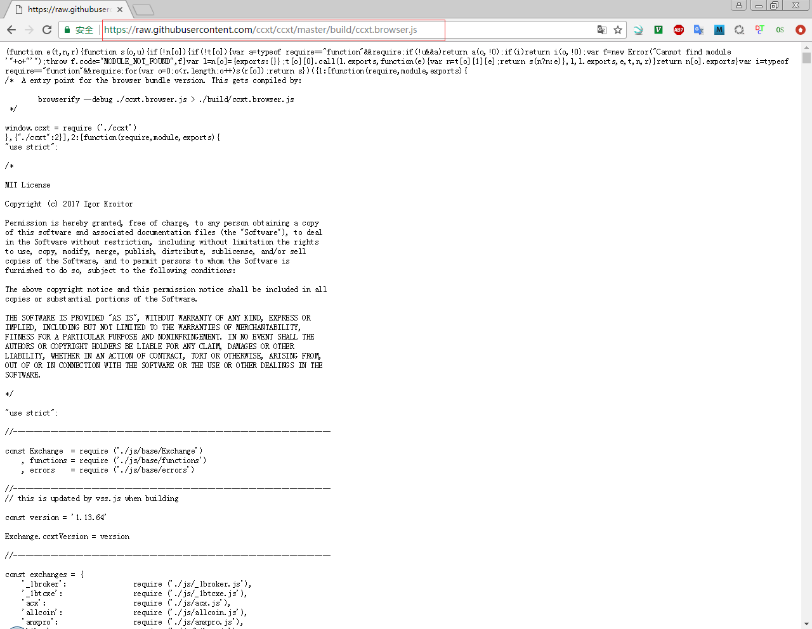
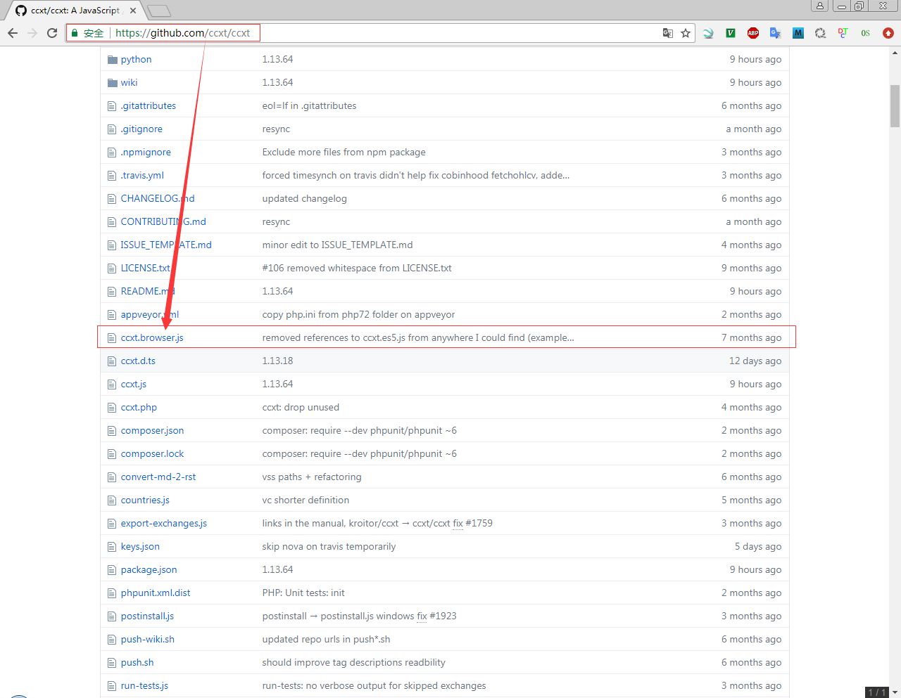

# Javascript CCXT

## 参考文档

* [ccxt/ccxt](https://github.com/ccxt/ccxt)
* [Browserify 使用指南](http://zhaoda.net/2015/10/16/browserify-guide/)

## 简单示例

* [Chrome Extansion Sample Code](./code/0009_Javascript_CCXT)

## 初略CCXT架构分析

### 引入JS

* `<script type="text/javascript" src="https://unpkg.com/ccxt"></script>`
* 查看库依赖：
  
* 查找库位置：
    
  
* `ccxt/ccxt.browser.js`
  ```Javascript
  /*  A entry point for the browser bundle version. This gets compiled by:
          
          browserify --debug ./ccxt.browser.js > ./build/ccxt.browser.js
   */
  
  window.ccxt = require ('./ccxt')
  ```
* 目前NPM上有二十多万个NodeJS模块，它们都是通过CMD的方式打包的，除了特定的可以使用CMD模块加载器加载的模块，大部分nodejs模块无法直接使用到浏览器环境中。Browserify是一个供浏览器环境使用的模块打包工具，像在node环境一样，也是通过require('modules')来组织模块之间的引用和依赖，既可以引用npm中的模块，也可以引用自己写的模块，然后打包成js文件，再在页面中通过`<script>`标签加载。
* `ccxt.js`
  ```Javascript
  "use strict";
  
  [...省略]
  
  "use strict";
  
  //-----------------------------------------------------------------------------
  
  const Exchange  = require ('./js/base/Exchange')
      , functions = require ('./js/base/functions')
      , errors    = require ('./js/base/errors')
  
  //-----------------------------------------------------------------------------
  // this is updated by vss.js when building
  
  const version = '1.13.64'
  
  Exchange.ccxtVersion = version
  
  //-----------------------------------------------------------------------------
  
  const exchanges = {
      '_1broker':                require ('./js/_1broker.js'),
      '_1btcxe':                 require ('./js/_1btcxe.js'),
      'acx':                     require ('./js/acx.js'),
      'allcoin':                 require ('./js/allcoin.js'),
      [...省略]
      'yunbi':                   require ('./js/yunbi.js'),
      'zaif':                    require ('./js/zaif.js'),
      'zb':                      require ('./js/zb.js'),    
  }
  
  //-----------------------------------------------------------------------------
  
  module.exports = Object.assign ({ version, Exchange, exchanges: Object.keys (exchanges) }, exchanges, functions, errors)
  
  //-----------------------------------------------------------------------------
  ```
* `ccxt/js/okex.js`
  ```
  'use strict';
  
  // ---------------------------------------------------------------------------
  
  const okcoinusd = require ('./okcoinusd.js');
  
  // ---------------------------------------------------------------------------
  
  module.exports = class okex extends okcoinusd {

      [...省略]
  
      async fetchMarkets () {
          let markets = await super.fetchMarkets ();
          // TODO: they have a new fee schedule as of Feb 7
          // the new fees are progressive and depend on 30-day traded volume
          // the following is the worst case
          for (let i = 0; i < markets.length; i++) {
              if (markets[i]['spot']) {
                  markets[i]['maker'] = 0.0015;
                  markets[i]['taker'] = 0.0020;
              } else {
                  markets[i]['maker'] = 0.0003;
                  markets[i]['taker'] = 0.0005;
              }
          }
          return markets;
      }
      [...省略]
  };
  ```
* `ccxt/js/okcoinusd.js`
  ```
  'use strict';
  
  //  ---------------------------------------------------------------------------
  
  const Exchange = require ('./base/Exchange');
  const { ExchangeError, InsufficientFunds, InvalidOrder, OrderNotFound, AuthenticationError } = require ('./base/errors');
  
  //  ---------------------------------------------------------------------------
  
  module.exports = class okcoinusd extends Exchange {
      [...省略]
  };
  ```
* `ccxt/js/base/Exchange.js`
  ```
  [...省略]
  module.exports = class Exchange {
      [...省略]
      constructor (userConfig = {}) {
  
          Object.assign (this, functions, { encode: string => string, decode: string => string })
  
          if (isNode)
              this.nodeVersion = process.version.match (/\d+\.\d+.\d+/)[0]
  
          // if (isNode) {
          //     this.userAgent = {
          //         'User-Agent': 'ccxt/' + Exchange.ccxtVersion +
          //             ' (+https://github.com/ccxt/ccxt)' +
          //             ' Node.js/' + this.nodeVersion + ' (JavaScript)'
          //     }
          // }
  
          this.options = {} // exchange-specific options, if any
  
          this.userAgents = {
              'chrome': 'Mozilla/5.0 (Windows NT 10.0; Win64; x64) AppleWebKit/537.36 (KHTML, like Gecko) Chrome/62.0.3202.94 Safari/537.36',
              'chrome39': 'Mozilla/5.0 (Windows NT 6.1; WOW64) AppleWebKit/537.36 (KHTML, like Gecko) Chrome/39.0.2171.71 Safari/537.36',
          }
  
          this.headers = {}
  
          // prepended to URL, like https://proxy.com/https://exchange.com/api...
          this.proxy = ''
          this.origin = '*' // CORS origin
  
          this.iso8601          = timestamp => ((typeof timestamp === 'undefined') ? timestamp : new Date (timestamp).toISOString ())
          this.parse8601        = x => Date.parse ((((x.indexOf ('+') >= 0) || (x.slice (-1) === 'Z')) ? x : (x + 'Z').replace (/\s(\d\d):/, 'T$1:')))
          this.parseDate        = (x) => {
              if (typeof x === 'undefined')
                  return x
              return ((x.indexOf ('GMT') >= 0) ?
                  Date.parse (x) :
                  this.parse8601 (x))
          }
          this.microseconds     = () => now () * 1000 // TODO: utilize performance.now for that purpose
          this.seconds          = () => Math.floor (now () / 1000)
  
          this.minFundingAddressLength = 1 // used in checkAddress
          this.substituteCommonCurrencyCodes = true  // reserved
  
          // do not delete this line, it is needed for users to be able to define their own fetchImplementation
          this.fetchImplementation = defaultFetch
  
          this.timeout          = 10000 // milliseconds
          this.verbose          = false
          this.debug            = false
          this.journal          = 'debug.json'
          this.userAgent        = undefined
          this.twofa            = false // two-factor authentication (2FA)
  
          this.apiKey   = undefined
          this.secret   = undefined
          this.uid      = undefined
          this.login    = undefined
          this.password = undefined
  
          this.balance    = {}
          this.orderbooks = {}
          this.tickers    = {}
          this.orders     = {}
          this.trades     = {}
  
          this.last_http_response = undefined
          this.last_json_response = undefined
          this.last_response_headers = undefined
  
          this.arrayConcat = (a, b) => a.concat (b)
  
          const unCamelCaseProperties = (obj = this) => {
              if (obj !== null) {
                  for (const k of Object.getOwnPropertyNames (obj)) {
                      this[unCamelCase (k)] = this[k]
                  }
                  unCamelCaseProperties (Object.getPrototypeOf (obj))
              }
          }
          unCamelCaseProperties ()
  
          // merge configs
          const config = deepExtend (this.describe (), userConfig)
  
          // merge to this
          for (const [property, value] of Object.entries (config))
              this[property] = deepExtend (this[property], value)
  
          // generate old metainfo interface
          for (const k in this.has) {
              this['has' + capitalize (k)] = !!this.has[k] // converts 'emulated' to true
          }
  
          if (this.api)
              this.defineRestApi (this.api, 'request')
  
          this.initRestRateLimiter ()
  
          if (this.markets)
              this.setMarkets (this.markets)
  
          if (this.debug && journal) {
              journal (() => this.journal, this, Object.keys (this.has))
          }
      }
      [...省略]
  }
  
  ```

## Public/Private API

https://github.com/ccxt/ccxt/wiki/Manual#publicprivate-api
