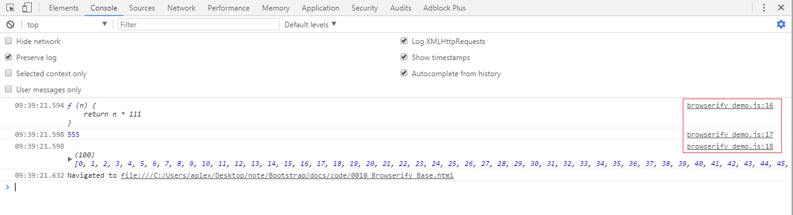

# Browserify Base

使用Browserify打包nodejs模块，并用minifier来生成最小js文件。

## 参考文档

* [Browserify 使用指南](http://zhaoda.net/2015/10/16/browserify-guide/)
* [browserify-handbook](https://github.com/browserify/browserify-handbook)
* [minifier](https://github.com/fizker/minifier)

## Example

* [Source Code](code/0010_Browserify_Base)
* 测试结果：  
  

## Install Packages

* `npm install -g minifier browserify`
