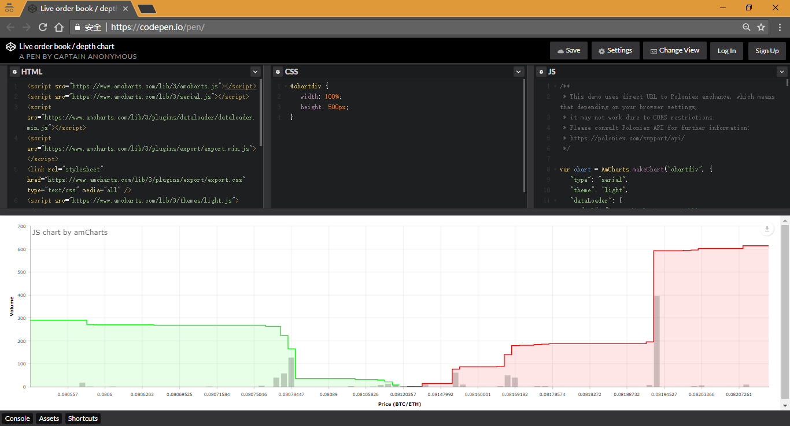

# Live order book/depth chart



## 参考文档

* [JavaScript Charts & Maps](https://www.amcharts.com/)
* [Live order book / depth chart](https://www.amcharts.com/demos/live-order-book-depth-chart/)
* [Order Book Visualisation](https://bl.ocks.org/schmidsi/e871a7c5372812f09978f2704bab10c4)
* [Live order book / depth chart](https://codepen.io/jaggedsoft/pen/yorKeV)
* [[enhancement] Need new external methods: setUrl(), reload() ](https://github.com/amcharts/dataloader/issues/9)

## url数据访问修改

* `chart.dataLoader.url="https://poloniex.com/public?command=returnOrderBook&currencyPair=BTC_ETH&depth=10";`
* `chart.dataLoader.loadData();`

## Code Hacking

```HTML
<!-- Styles -->
<style>
#chartdiv {
  width: 100%;
  height: 500px;
}
</style>

<!-- Resources -->
<!-- 加载相关依赖的库 -->
<script src="https://www.amcharts.com/lib/3/amcharts.js"></script>
<script src="https://www.amcharts.com/lib/3/serial.js"></script>
<script src="https://www.amcharts.com/lib/3/plugins/dataloader/dataloader.min.js"></script>
<script src="https://www.amcharts.com/lib/3/plugins/export/export.min.js"></script>
<link rel="stylesheet" href="https://www.amcharts.com/lib/3/plugins/export/export.css" type="text/css" media="all" />
<script src="https://www.amcharts.com/lib/3/themes/light.js"></script>

<!-- Chart code -->
<script>
/**
 * This demo uses direct URL to Poloniex exchance, which means that depending on your browser settings,
 * it may not work dure to CORS restrictions.
 * Please consult Poloniex API for further information:
 * https://poloniex.com/support/api/
 */

/** 
 * makeChart(container, chartConfig, delay) 
 * Creates chart. container can be either id or the reference to the element you want the chart to be placed in, chartConfig is JSON object with chart properties defined and delay is time in ms, in which the chart should be rendered (renders instantly if not set).
 * 
 * https://docs.amcharts.com/3/javascriptcharts/AmSerialChart
*/
var chart = AmCharts.makeChart("chartdiv", {
  "type": "serial",
  "theme": "light",
  /**
   * A config object for Data Loader plugin. Please refer to the following page for more information. 
   * http://www.amcharts.com/kbase/using-data-loader-plugin/
   */
  "dataLoader": {
    "url": "https://poloniex.com/public?command=returnOrderBook&currencyPair=BTC_ETH&depth=50",
    /* Type of data: json, csv */
    "format": "json",
    /* Reload data every X seconds */
    "reload": 30,
    /* If set to function reference, that function will be called to “post-process” loaded data before passing it on to chart */
    "postProcess": function(data) {
      
      // Function to process (sort and calculate cummulative volume)
      // 处理函数
      function processData(list, type, desc) {
        
        // Convert to data points， 提取数据到list中
        for(var i = 0; i < list.length; i++) {
          list[i] = {
            value: Number(list[i][0]),
            volume: Number(list[i][1]),
          }
        }
       
        // Sort list just in case，按value对list进行排序，递增排序
        list.sort(function(a, b) {
          if (a.value > b.value) {
            return 1;
          }
          else if (a.value < b.value) {
            return -1;
          }
          else {
            return 0;
          }
        });
        
        // Calculate cummulative volume
        // bids是倒序
        if (desc) {
          for(var i = list.length - 1; i >= 0; i--) {
            if (i < (list.length - 1)) {
              list[i].totalvolume = list[i+1].totalvolume + list[i].volume;
            }
            else {
              list[i].totalvolume = list[i].volume;             // 第一个数据，本身的数量就当前累计数量
            }
            var dp = {};
            dp["value"] = list[i].value;
            dp[type + "volume"] = list[i].volume;
            dp[type + "totalvolume"] = list[i].totalvolume;
            /**
             * unshift() 方法将把它的参数插入 arrayObject 的头部，并将已经存在的元素顺次地移到较高的下标处，
             * 以便留出空间。该方法的第一个参数将成为数组的新元素 0，如果还有第二个参数，它将成为新的元素 1，
             * 以此类推。
             * 
             * 请注意，unshift() 方法不创建新的创建，而是直接修改原有的数组。
             */
            res.unshift(dp);
          }
        }
        // asks是升序
        else {
          for(var i = 0; i < list.length; i++) {
            if (i > 0) {
              list[i].totalvolume = list[i-1].totalvolume + list[i].volume;
            }
            else {
              list[i].totalvolume = list[i].volume;
            }

            // 将当前list节点数据存入res中
            var dp = {};
            dp["value"] = list[i].value;
            dp[type + "volume"] = list[i].volume;
            dp[type + "totalvolume"] = list[i].totalvolume;
            res.push(dp);
          }
        }
       
      }
      
      // Init，并分别处理bids和asks的数据
      var res = [];
      processData(data.bids, "bids", true);
      processData(data.asks, "asks", false);
      
      //console.log(res);
      return res;
    }
  },
  /** 
   * The array of graphs belonging to this chart. 
   * https://docs.amcharts.com/3/javascriptcharts/AmGraph
   * 
   * 这里有2条曲线（step）和2条柱状线（column）
   */
  "graphs": [{
    // Unique id of a graph. It is not required to set one, unless you want to use this graph for as your scrollbar's graph and need to indicate which graph should be used.
    "id": "bids",
    "fillAlphas": 0.1,          // 填充透明度
    "lineAlpha": 1,             // 线透明度
    "lineThickness": 2,         // 线宽
    "lineColor": "#0f0",        // 线的颜色
    // Type of the graph. Possible values are: "line", "column", "step", "smoothedLine", "candlestick", "ohlc". XY and Radar charts can only display "line" type graphs.
    "type": "step",
    // Name of the value field in your dataProvider.
    "valueField": "bidstotalvolume",
    // If you set some function, the graph will call it and pass GraphDataItem and AmGraph objects to it. This function should return a string which will be displayed in a balloon.
    "balloonFunction": balloon
  }, {
    "id": "asks",
    "fillAlphas": 0.1,
    "lineAlpha": 1,
    "lineThickness": 2,
    "lineColor": "#f00",
    "type": "step",
    "valueField": "askstotalvolume",
    "balloonFunction": balloon
  }, {
    "lineAlpha": 0,
    "fillAlphas": 0.2,
    "lineColor": "#000",
    "type": "column",
    "clustered": false,
    "valueField": "bidsvolume",
    "showBalloon": false
  }, {
    "lineAlpha": 0,
    "fillAlphas": 0.2,
    "lineColor": "#000",
    "type": "column",
    "clustered": false,
    "valueField": "asksvolume",
    "showBalloon": false
  }],
  // Category field name tells the chart the name of the field in your dataProvider object which will be used for category axis values.
  "categoryField": "value",
  "chartCursor": {},
  "balloon": {
    "textAlign": "left"
  },
  "valueAxes": [{
    "title": "Volume"
  }],
  "categoryAxis": {
    "title": "Price (BTC/ETH)",
    "minHorizontalGap": 100,
    "startOnAxis": true,
    "showFirstLabel": false,
    "showLastLabel": false
  },
  "export": {
    "enabled": true
  }
});

// 当鼠标在去线上移动时，弹出的消息框
// If you set some function, the graph will call it and pass GraphDataItem and AmGraph objects to it. This function should return a string which will be displayed in a balloon.
// graph.chart: https://docs.amcharts.com/3/javascriptcharts/AmChart
function balloon(item, graph) {
  var txt;
  // dataContext: Original object from data provider.
  if (graph.id == "asks") {
    txt = "Ask: <strong>" + formatNumber(item.dataContext.value, graph.chart, 4) + "</strong><br />"
      + "Total volume: <strong>" + formatNumber(item.dataContext.askstotalvolume, graph.chart, 4) + "</strong><br />"
      + "Volume: <strong>" + formatNumber(item.dataContext.asksvolume, graph.chart, 4) + "</strong>";
  }
  else {
    txt = "Bid: <strong>" + formatNumber(item.dataContext.value, graph.chart, 4) + "</strong><br />"
      + "Total volume: <strong>" + formatNumber(item.dataContext.bidstotalvolume, graph.chart, 4) + "</strong><br />"
      + "Volume: <strong>" + formatNumber(item.dataContext.bidsvolume, graph.chart, 4) + "</strong>";
  }

  return txt;
}

function formatNumber(val, chart, precision) {
  return AmCharts.formatNumber(
    val, 
    {
      precision: precision ? precision : chart.precision, 
      decimalSeparator: chart.decimalSeparator,
      thousandsSeparator: chart.thousandsSeparator
    }
  );
}
</script>

<!-- HTML -->
<div id="chartdiv"></div>
```
