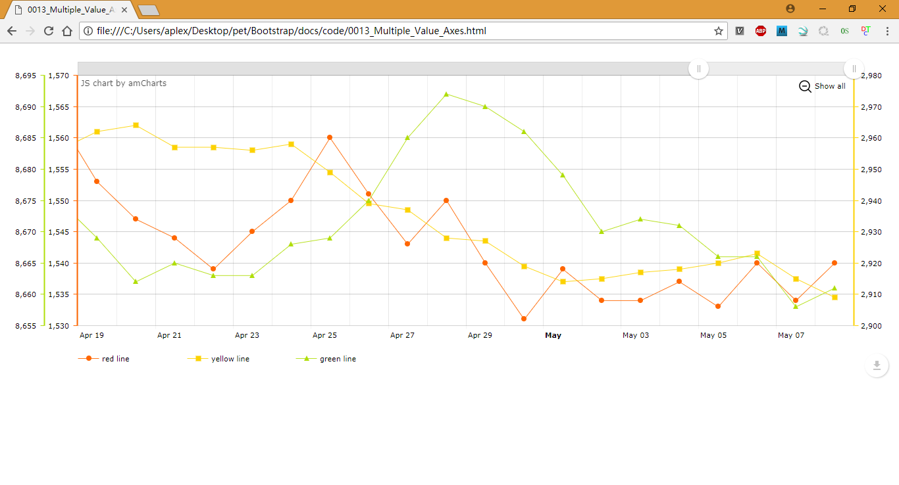

# Multiple Value Axes



## 参考文档

* [Dynamically changing data granularity on a Serial chart](https://www.amcharts.com/kbase/dynamically-changing-data-granularity-serial-chart/)

## Code Hacking

```HTML
<!-- Styles -->
<style>
#chartdiv {
    width    : 100%;
    height    : 500px;
}                                                    
</style>

<!-- Resources -->
<script src="https://www.amcharts.com/lib/3/amcharts.js"></script>
<script src="https://www.amcharts.com/lib/3/serial.js"></script>
<script src="https://www.amcharts.com/lib/3/themes/light.js"></script>
<script src="https://www.amcharts.com/lib/3/plugins/export/export.min.js"></script>
<link rel="stylesheet" href="https://www.amcharts.com/lib/3/plugins/export/export.css" type="text/css" media="all" />

<!-- Chart code -->
<script>
var chartData = generateChartData();

var chart = AmCharts.makeChart("chartdiv", {
    "type": "serial",
    "theme": "light",
    "legend": {
        "useGraphSettings": true
    },
    "dataProvider": chartData,
    // If you set synchronizeGrid property of AmSerialChart to true, the chart will adjust minimum and maximum of axes so that the grid would be show at equal intervals. This helps users to compare values more easily.
    "synchronizeGrid":true,
    // The array of value axes. Chart creates one value axis automatically, so if you need only one value axis, you don't need to create it.
    "valueAxes": [{
        "id":"v1",
        "axisColor": "#FF6600",
        "axisThickness": 2,
        "axisAlpha": 1,
        // Possible values are: "top", "bottom", "left", "right". If axis is vertical, default position is "left". If axis is horizontal, default position is "bottom".
        "position": "left"
    }, {
        "id":"v2",
        "axisColor": "#FCD202",
        "axisThickness": 2,
        "axisAlpha": 1,
        "position": "right"
    }, {
        "id":"v3",
        "axisColor": "#B0DE09",
        "axisThickness": 2,
        "gridAlpha": 0,
        "offset": 50,
        "axisAlpha": 1,
        "position": "left"
    }],
    "graphs": [{
        "valueAxis": "v1",
        "lineColor": "#FF6600",
        // Type of the bullets. Possible values are: "none", "round", "square", "triangleUp", "triangleDown", "triangleLeft", "triangleRight", "bubble", "diamond", "xError", "yError" and "custom".
        "bullet": "round",
        "bulletBorderThickness": 1,
        // If there are more data points than hideBulletsCount, the bullets will not be shown. 0 means the bullets will always be visible.
        "hideBulletsCount": 30,
        "title": "red line",
        "valueField": "visits",
        "fillAlphas": 0
    }, {
        "valueAxis": "v2",
        "lineColor": "#FCD202",
        "bullet": "square",
        "bulletBorderThickness": 1,
        "hideBulletsCount": 30,
        "title": "yellow line",
        "valueField": "hits",
        "fillAlphas": 0
    }, {
        "valueAxis": "v3",
        "lineColor": "#B0DE09",
        "bullet": "triangleUp",
        "bulletBorderThickness": 1,
        "hideBulletsCount": 30,
        "title": "green line",
        "valueField": "views",
        "fillAlphas": 0
    }],
    // show Chart's scrollbar.
    "chartScrollbar": {},
    "chartCursor": {
        "cursorPosition": "mouse"
    },
    // Category field name tells the chart the name of the field in your dataProvider object which will be used for category axis values.
    "categoryField": "date",
    "categoryAxis": {
        // In case your category axis values are Date objects, set this to true. In this case the chart will parse dates and will place your data points at irregular intervals. If you want dates to be parsed, but data points to be placed at equal intervals, set both parseDates and equalSpacing to true.
        "parseDates": true,
        "axisColor": "#DADADA",
        // Specifies if minor grid should be displayed.
        "minorGridEnabled": true
    },
    "export": {
        "enabled": true,
        "position": "bottom-right"
     }
});

// 缩放功能
chart.addListener("dataUpdated", zoomChart);
zoomChart();


// generate some random data, quite different range
function generateChartData() {
    var chartData = [];
    var firstDate = new Date();
    // 将日期对象设置为 100 天前的日期
    firstDate.setDate(firstDate.getDate() - 100);

        var visits = 1600;
        var hits = 2900;
        var views = 8700;


    for (var i = 0; i < 100; i++) {
        // we create date objects here. In your data, you can have date strings
        // and then set format of your dates using chart.dataDateFormat property,
        // however when possible, use date objects, as this will speed up chart rendering.
        var newDate = new Date(firstDate);
        newDate.setDate(newDate.getDate() + i);

        visits += Math.round((Math.random()<0.5?1:-1)*Math.random()*10);
        hits += Math.round((Math.random()<0.5?1:-1)*Math.random()*10);
        views += Math.round((Math.random()<0.5?1:-1)*Math.random()*10);

        chartData.push({
            date: newDate,                  // 日期
            visits: visits,
            hits: hits,
            views: views
        });
    }
    return chartData;
}

function zoomChart(){
    chart.zoomToIndexes(chart.dataProvider.length - 20, chart.dataProvider.length - 1);
}

</script>

<!-- HTML -->
<div id="chartdiv"></div>                    
```
